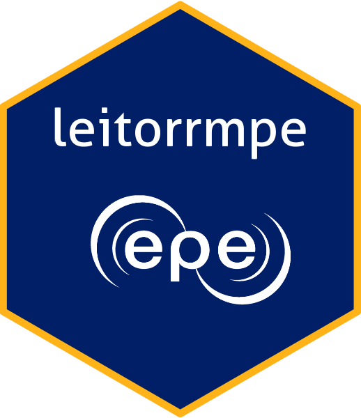

<!-- README.md is generated from README.Rmd. Please edit that file -->

```{r, include = FALSE}
knitr::opts_chunk$set(
  collapse = TRUE,
  comment = "#>",
  out.width = "100%"
)
```

# leitorrmpe

<!-- badges: start -->

<!-- badges: end -->



O pacote leitorrmpe é um conjunto de funções que faz a leitura de diversos arquivos dos de entrada e saída dos Modelos do Planejamento Energético do CEPEL, principalmente do Modelo NEWAVE.

## Instalação

Você pode instalar o pacote através do repositório da EPE no GitHub:

``` r
devtools::install_github("EPE-GOV-BR/leitorrmpe")
```

## Como usar

As funções do pacote podem ser visualizadas pelo "help" do R escrevendo-se no *command* do R `help(package = leitorrmpe)` depois do pacote devidamente instalado. Com isso pode-se ver a descrição de cada função e como podem ser executadas.